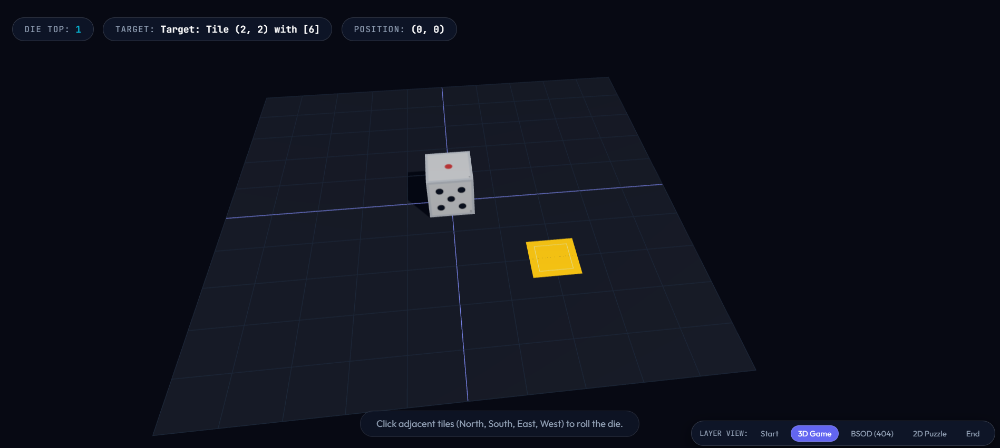
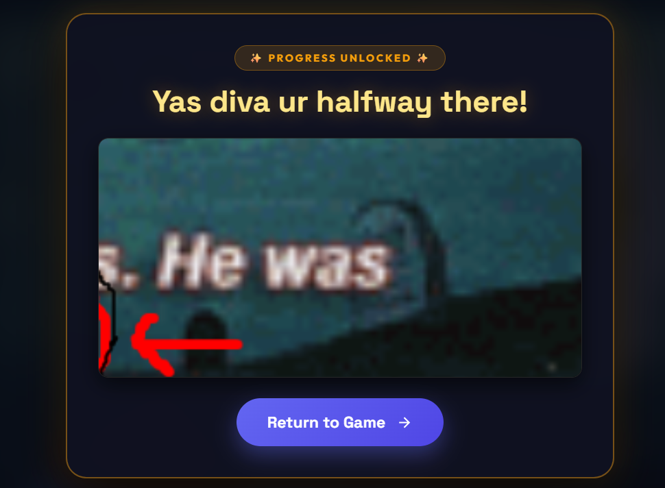

The Dice Deception 🎯
Basic Details
Team Name: Solodev
Team Members
Team Lead: Ishitha Benny - Christ College of Engineering

Project Description
A deceptively simple spatial reasoning game where players roll a 3D die across a coordinate grid to land on a target tile. Executing the perfect sequence triggers a fake system crash, forcing players to solve fragmented meme puzzles to discover the actual winning conditions.

The Problem (that doesn't exist)
Players have too much trust in standard video game win conditions and experience far too much joy when they successfully solve a spatial logic puzzle. The world desperately needs a game that actively gaslights them at the exact moment of triumph.

The Solution (that nobody asked for)
We built a perfectly functional grid navigation game that purposely subverts victory. Instead of a congratulatory message, completing the level throws a fake "Blue Screen of Death" error and forces the player to assemble poorly sliced internet memes just to figure out what number they actually needed to land on.

Technical Details
Technologies/Components Used
For Software:

Languages used: JavaScript, HTML, CSS

Frameworks/Libraries used: React (or Vanilla JS), Three.js (for the 3D die mechanics)

Tools used: Vite, Git, GitHub, Vercel (Hosting), Photopea (for meme asset slicing)

Implementation
For Software:

Installation
Bash
# Clone the repository
git clone https://github.com/IshithaBenny/Solodev.git

# Navigate into the project directory
cd C:\Users\Ishitha Benny\Documents\Solodev

# Install dependencies
npm install
Run
Bash
# Start the local Vite development server
npm run dev
Open http://localhost:5173 in your browser.

Project Documentation
Screenshots

Team Contributions
Ishitha Benny: Sole developer. Responsible for core game state management (gameState.js), 3D die rotation logic, grid coordinate tracking, dynamic image routing for the fragmented meme arrays, user interface design, rendering the 2D puzzle container, formatting the custom error screens, and continuous deployment via Vercel.

Made with ❤️ at TinkerHub Useless Projects